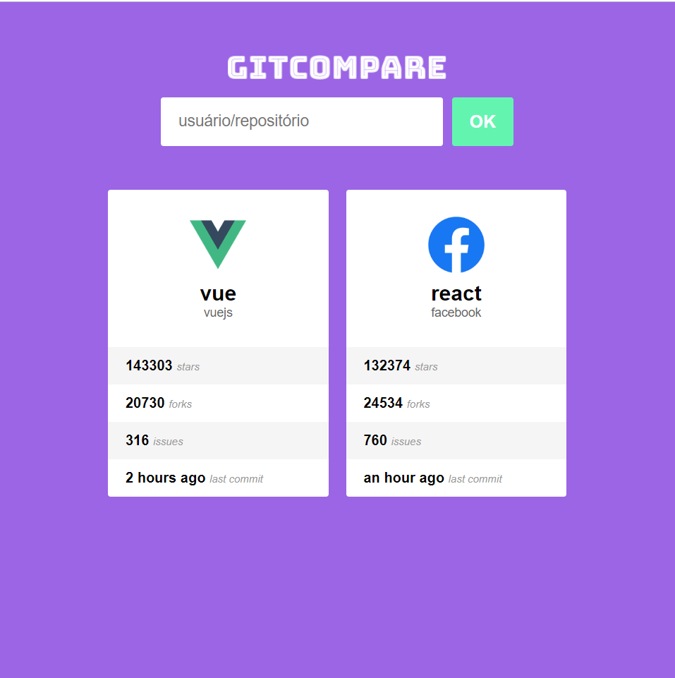
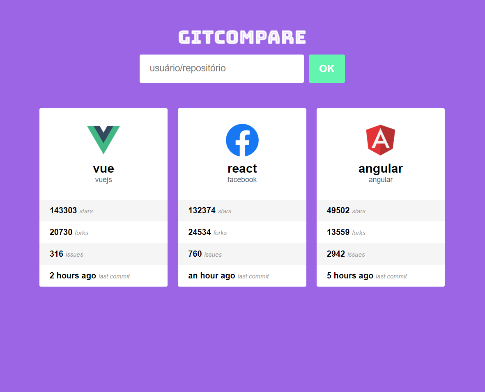

# Git Compare :octocat:

## Rodando o projeto

> Baixe ou clone este repositório.

> Acesse a raiz do projeto por um console e execute:

- `yarn ou npm i` para instalar as dependências do projeto
- `yarn start ou npm start` para rodar a aplicação no localhost

## Sobre o projeto: 📃

Git compare é um app web desenvolvido com React Js, seu objetivo é comparar respositórios do Github.

## Requisitos do projeto: ✅

- ##### Git Compare

> Uma tela inicial com um formulário onde o usuário pode pesquisar por repositórios, digitando o nome de usuário do dono e o nome do repositório, e assim fazer comparações visualizando a quantidade de estrelas, forks, issues e a quanto tempo foi o último commit.

## Frameworks e Tecnologias Utilizadas: 🌌

### Front-End: 🎨

- <strong>React Js</strong> (Criação da interface)
- <strong>Styled Components</strong> (Estilização do app)

### Backend: 💾

- <strong>API do Github</strong> (API utilizada para receber os dados dos repositórios)

## Imagens: 📷

### <strong>Imagem 1:</strong>

### <strong>Imagem 2:</strong>

